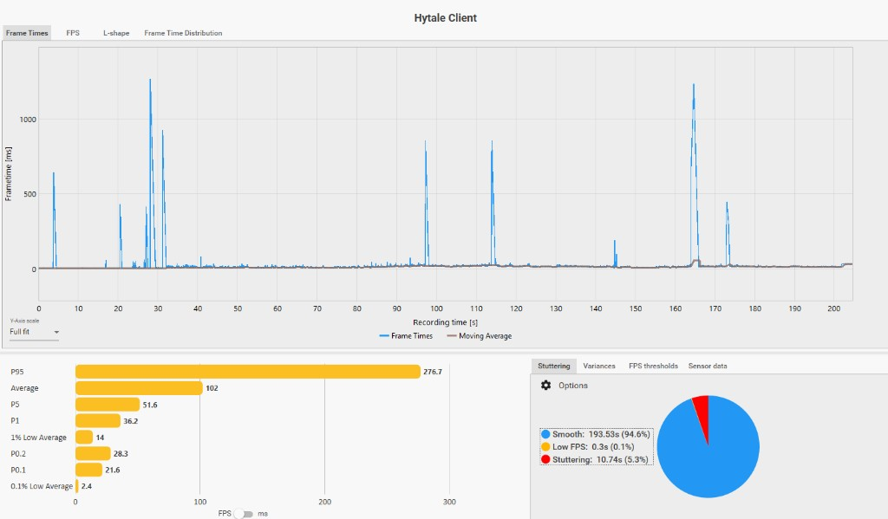
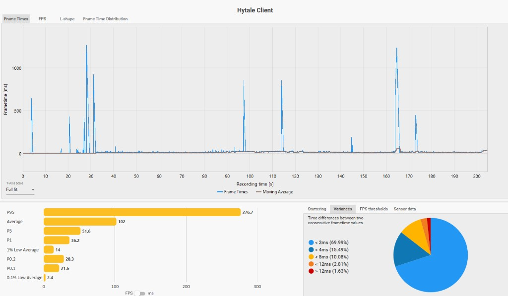
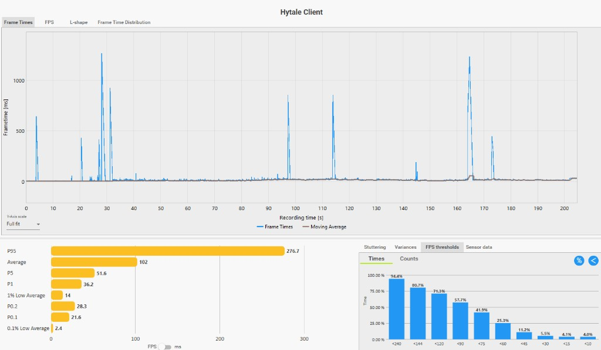
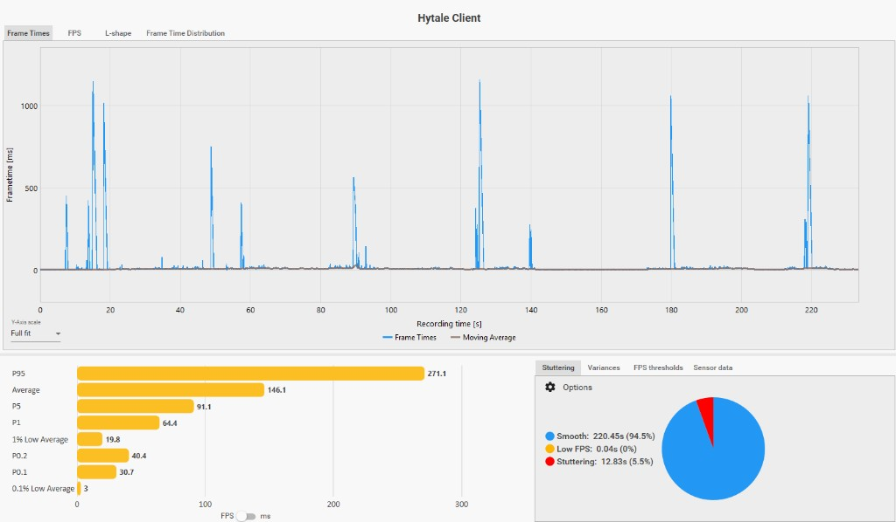
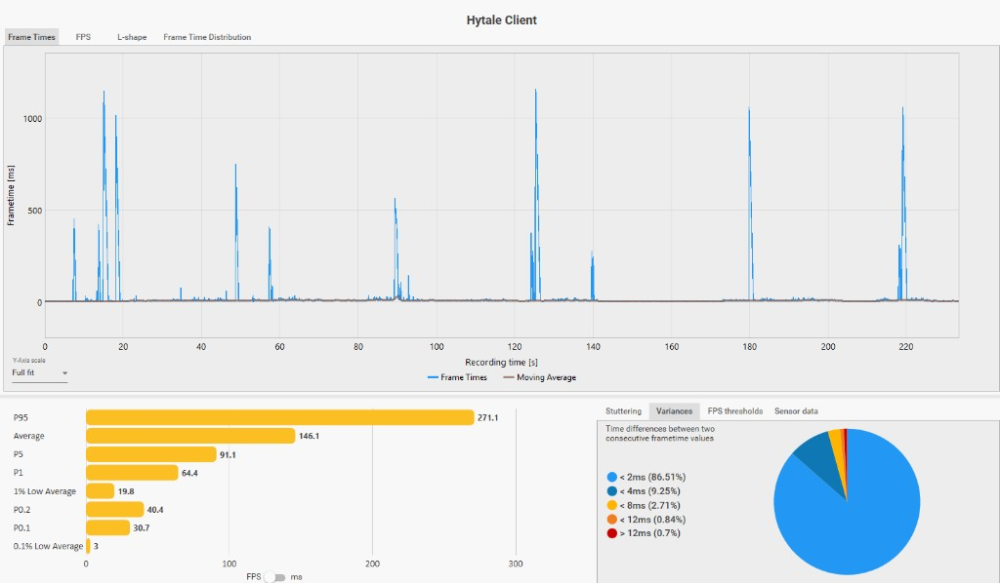
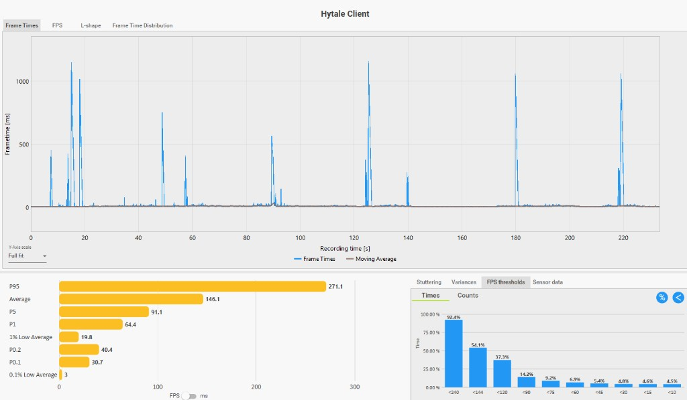

[](https://www.curseforge.com/hytale/mods/quantumhy)

# QuantumHy

QuantumHy is a server-side mod that makes your client run smoother in Hytale. It works by cutting
how much the server tells your client to draw, and it adjusts that per player depending on where
you are.

## How it actually works

The Hytale client is native, so no mod can touch the renderer. What a server mod can do is decide
how much each client has to render, and that's the whole trick here: fewer chunks and entities in
view means fewer things to draw, which means more FPS.

Two honest limits:

- It only helps where it's installed. Your singleplayer world, your own server, or a server that
  runs it. If you just join someone else's server, this can't do anything there.
- It never pushes your view further than you asked for. Your own view radius is the cap. QuantumHy
  only ever pulls it down, never up.

## What it does

Every few seconds it checks how crowded the area around each player is (lots of entities means
expensive to render) and sets the client view radius to match:

- Out in the open with nothing around: you get your full view radius back.
- Packed area with tons of stuff: it pulls your view in toward the minimum, so your FPS doesn't
  tank exactly where it normally would.
- Still loading chunks (just joined, or moving fast): it leaves your view alone, so it doesn't make
  the client drop chunks it's busy loading.

Out of the box there's no hard cap, so you lose nothing in the open and only get trimmed when it's
crowded. If you'd rather trade some view distance for FPS everywhere, set `targetClientViewRadius`
above 0.

It also smooths how fast chunks stream to you, so moving into fresh terrain arrives spread out
instead of in one burst that makes the client hitch. That's the `smoothChunkStreaming` keys below.

## Performance

Solo world, same stress route (birds and mobs on screen). Client frametime capture on the **Hytale
Client** process. Two runs: QuantumHy disabled vs default config enabled. Not a lab benchmark: run
lengths differ slightly (~205s off, ~233s on).

### Test PC

| Component | Spec |
| --- | --- |
| CPU | AMD Ryzen 5 3600 |
| GPU | NVIDIA GeForce GTX 1650 4GB |
| RAM | 16 GB (2×8 GB) |

### At a glance

| Metric | Mod off | Mod on | Change |
| --- | ---: | ---: | --- |
| Average FPS | 102 | 146 | **+43%** |
| P5 | 51.6 | 91.1 | **+76%** |
| P1 | 36.2 | 64.4 | **+78%** |
| 1% low average | 14.0 | 19.8 | **+41%** |
| Time under 60 FPS | 25.3% | 6.9% | **−73%** of that slice |

P95 stayed high on both runs (~277 off, ~271 on). The big win is less time spent under 60 FPS and
higher floor percentiles when the scene is busy. Massive frametime spikes (500ms–1s+) still show up
on both runs, so QuantumHy helps sustained crowd load more than it removes one-off hitches.

### Full capture

| Metric | Mod off | Mod on |
| --- | ---: | ---: |
| Recording length | ~205 s | ~233 s |
| Average FPS | 102 | 146.1 |
| P95 | 276.7 | 271.1 |
| P5 | 51.6 | 91.1 |
| P1 | 36.2 | 64.4 |
| 1% low average | 14.0 | 19.8 |
| P0.2 | 28.3 | 40.4 |
| P0.1 | 21.6 | 30.7 |
| 0.1% low average | 2.4 | 3.0 |
| Stuttering (time) | 5.3% (10.7 s) | 5.5% (12.8 s) |
| Smooth | 94.6% | 94.5% |
| Under 240 FPS | 94.4% | 92.4% |
| Under 60 FPS | 25.3% | 6.9% |
| Under 30 FPS | 5.5% | 4.8% |
| Under 10 FPS | 4.0% | 4.5% |
| Frametime variance < 2 ms | 70.0% | 86.5% |

### Charts (mod off vs on)

Each capture is the full session: frametime graph on top, plus one analysis panel below.

**Mod off**







**Mod on**







### Video

Mod off: https://www.youtube.com/watch?v=H6Vns8b4hAg

<p align="center">
  <a href="https://www.youtube.com/watch?v=H6Vns8b4hAg">
    
  </a>
</p>

Mod on: https://www.youtube.com/watch?v=CKGlXmX1M6k

<p align="center">
  <a href="https://www.youtube.com/watch?v=CKGlXmX1M6k">
    
  </a>
</p>

## Config

Lives in `QuantumHy.json` in the plugin data folder, created on first run.

| Key | Default | What it does |
| --- | --- | --- |
| `enabled` | `true` | Turn the whole thing on or off. |
| `verboseLog` | `true` | Log every pass with each player's density and view decision. |
| `tickIntervalSeconds` | `5` | How often it re-checks each player. |
| `initialDelaySeconds` | `20` | Wait this long after start before the first pass. |
| `targetClientViewRadius` | `0` | Hard cap in chunks. `0` means no cap, just adapt. |
| `minClientViewRadius` | `6` | Never pull anyone below this. |
| `maxClientViewRadius` | `32` | Ceiling for the hard cap (your own view radius still wins). |
| `densityScanChunkRadius` | `4` | How many chunks around you it counts entities in. |
| `densityLowPerChunk` | `2.0` | Entities per chunk at or below this: you get the full radius. |
| `densityHighPerChunk` | `8.0` | Entities per chunk at or above this: you get pulled to the minimum. |
| `densitySmoothing` | `0.4` | Smooths the density signal so a moving player's view doesn't flip-flop. Lower is smoother; `1.0` is off. |
| `adaptEntityRadius` | `true` | Also shrink how far entities are streamed (not just chunks). The big win in mob-heavy spots. |
| `minEntityViewBlocks` | `48` | Never stream entities closer than this, in blocks (16 blocks = 1 chunk). |
| `entityLodAggressiveness` | `1.5` | Global entity LOD cull. `1.0` is the engine default; higher drops small/distant entities sooner. |
| `maxEntityVerticalDistance` | `40` | Drop entities too far above/below you from the stream (caves, ceilings). `0` = off. |
| `maxVisibleEntitiesPerPlayer` | `0` | Cap streamed entities per player in crowds (`0` = off). |
| `holdSpawnOnLoadingChunks` | `true` | Pause environmental spawning while any player has chunks streaming to the client. |
| `minViewRadiusDelta` | `2` | Don't bother changing the view for tiny differences. |
| `respectStreamingGrace` | `true` | Don't shrink while you're still loading chunks. |
| `streamingBacklogThreshold` | `8` | How many loading chunks counts as "still streaming". |
| `smoothChunkStreaming` | `true` | Spread chunk streaming out so moving into new terrain doesn't hitch. |
| `maxChunksPerSecond` | `128` | Cap on chunks streamed per second to a managed client. `0` keeps the engine default. |
| `maxChunksPerTick` | `2` | Cap on chunks streamed per tick. This is the real anti-hitch lever (engine default is 4). `0` keeps the default. |
| `leanCoreTakeover` | `true` | If LeanCore is installed, take the view radius over from it (see below). |
| `yieldToLeanCoreViewRadius` | `false` | The opposite: leave the view radius to LeanCore (see below). |
| `pressureGovernorEnabled` | `true` | Tighten render levers when world MSPT stays high. |
| `pressureMsptEnter` | `52` | 10s average MSPT at or above this enters pressure mode. |
| `pressureMsptExit` | `47` | MSPT at or below this exits pressure mode (hysteresis). |
| `pressureSustainSeconds` | `6` | How long MSPT must stay high before levers tighten. |
| `pressureCooldownSeconds` | `15` | How long MSPT must stay low before levers restore. |
| `pressureDensityMultiplier` | `1.35` | Under pressure, density thresholds tighten by this factor. |
| `pressureChunkRateMultiplier` | `0.75` | Under pressure, multiply chunk streaming caps. |
| `pressureLodMultiplier` | `1.15` | Under pressure, extra entity LOD cull on top of `entityLodAggressiveness`. |
| `pressureVerticalTrimBlocks` | `8` | Under pressure, subtract from `maxEntityVerticalDistance`. |
| `pressureWorldLevers` | `false` | Under pressure, pause NPC spawn and block tick on the world config (restored on release). |
| `pressureTrimClientEffects` | `true` | Under pressure, trim bloom/sunshaft client effects (restored on release). |
| `pressureEffectScale` | `0.5` | Multiplier for client effect intensities while trimmed. |

## Running with LeanCore

Both mods can run together. Each one owns different levers, so they are not fighting over the
same `ChunkTracker` or `Player` fields.

| Lever | Who drives it (typical setup) |
| --- | --- |
| Client view radius | **QuantumHy** when `leanCoreTakeover=true` (default). QuantumHy turns off LeanCore view governance on startup. |
| Entity stream radius | **QuantumHy** |
| Hot/simulation radius | **LeanCore** |
| Chunk send rate (`maxChunks/s`, `maxChunks/tick`) | **QuantumHy** when `smoothChunkStreaming=true` (default) |
| MSPT render trim (density, LOD, vertical, effects) | **QuantumHy** |
| Spawn stream pause | **QuantumHy** |
| Zone dormancy / memory | **LeanCore** |

Defaults on both mods already line up: `leanCoreTakeover=true`, QuantumHy `smoothChunkStreaming=true`,
LeanCore handling sim/memory. No extra LeanCore config required for a normal install.

**Knobs if you need them**

- `leanCoreTakeover` (default `true`): QuantumHy drives client view radius and disables LeanCore
  view governance. Set `false` only if you want LeanCore on view radius instead (both mods may
  conflict).
- `yieldToLeanCoreViewRadius` (default `false`): QuantumHy stays out of view radius and chunk
  send-rate entirely. Use this if you deliberately want LeanCore in charge of those levers.

Do not flip on QuantumHy `pressureWorldLevers` alongside LeanCore unless you mean to pause NPC
spawn and block tick under MSPT. LeanCore does not touch those flags.

`/q status` shows live ownership (`chunkRateOwner=`, `LeanCore: view=...`) and the last adaptive
pass per player.

## Commands

- `/q status` (alias `/quantumhy`, `/qhy`): shows what QuantumHy is doing right now, the active
  levers, per-player chunk load, and the last density/view decision from the adaptive pass.
- `/q help`: lists the commands.

## Build

You need a Hytale install (that's where `HytaleServer.jar` comes from) and JDK 25.

```
./gradlew build
```

The jar lands in `build/libs/`. Drop it in `%AppData%/Hytale/UserData/Mods/` to test it.

## Links

- [Mod page](https://durkzprgmods.pages.dev/mods/quantumhy)
- [Docs](https://durkzprgmods.pages.dev/documentation/quantumhy)
- [GitHub](https://github.com/DurkzPRG/QuantumHy)
- [CurseForge](https://www.curseforge.com/hytale/mods/quantumhy)

## License

MIT. See [LICENSE](LICENSE).
